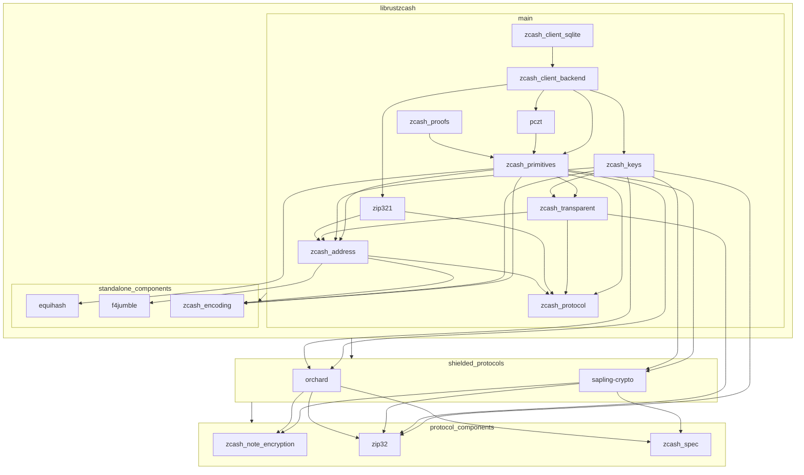

# Zcash Rust crates

This repository contains a (work-in-progress) set of Rust crates for working
with Zcash.

### Crates

[librustzcash: a Rust Crates Walkthrough w/ nuttycom](https://free2z.cash/uploadz/public/ZcashTutorial/librustzcash-a-rust-crates.mp4)

#### Zcash Protocol

* `zcash_protocol`: Constants & common types
  - consensus parameters
  - bounded value types (Zatoshis, ZatBalance)
  - memo types
* `zcash_transparent`: Bitcoin-derived transparent transaction components
  - transparent addresses
  - transparent input, output, and bundle types
  - support for transparent parts of pczt construction
* `zcash_primitives`: Core utilities for working with Zcash transactions
  - the primary transaction data type
  - transaction builder(s)
  - proving, signing, & serialization
  - low-level fee types
* `zcash_proofs`: The Sprout circuit & proving system

#### Keys, Addresses & Wallet Support

* `zcash_address`: Parsing & serialization of Zcash addresses
  - unified address, fvk & ivk containers
  - no dependencies on protocol-specific types
  - serialization API definitions
* `zip321`: Parsing & serizalization for ZIP 321 payment requests
* `zcash_keys`: Spending Keys, Viewing Keys, & Addresses
  - protocol-specific & Unified address types
  - ZIP 32 key & address derivation implementations
  - Unified spending keys & viewing keys
  - Sapling spending & viewing key types
* `pczt`: Data types & interfaces for PCZT construction
  - partially constructed transaction types
  - transaction construction role interfaces & partial implementations
* `zcash_client_backend`: A wallet framework for Zcash
  - wallet data storage APIs
  - chain scanning
  - light client protocol support
  - fee calculation
  - transaction proposals & high-level transaction construction APIs
* `zcash_client_sqlite`: SQLite-based implementation of `zcash_client_backend` storage APIs

#### Utilities & Common Dependencies

* `f4jumble`: Encoding for Unified addresses
* `zcash_encoding`: Bitcoin-derived transaction encoding utilities for Zcash
* `equihash`: Proof-of-work protocol implementation

## Security Warnings

These libraries are under development and have not been fully reviewed.

## License

All code in this workspace is licensed under either of

 * Apache License, Version 2.0, ([LICENSE-APACHE](LICENSE-APACHE) or http://www.apache.org/licenses/LICENSE-2.0)
 * MIT license ([LICENSE-MIT](LICENSE-MIT) or http://opensource.org/licenses/MIT)

at your option.

### Contribution

Unless you explicitly state otherwise, any contribution intentionally submitted
for inclusion in the work by you, as defined in the Apache-2.0 license, shall
be dual licensed as above, without any additional terms or conditions.
