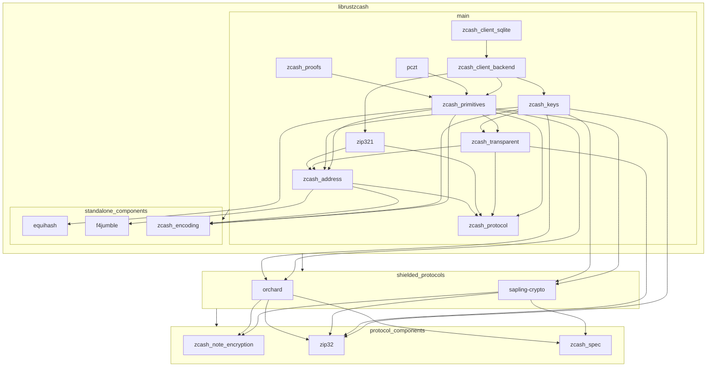

# Zcash Rust crates

This repository contains a (work-in-progress) set of Rust crates for working
with Zcash.

### Crates

#### Zcash Protocol

* `zcash_protocol`: Constants & common types
  - consensus parameters
  - bounded value types (Zatoshis, ZatBalance)
  - memo types
* `zcash_transparent`: Bitcoin-derived transparent transaction components
  - transparent addresses
  - transparent input, output, and bundle types
  - support for transparent parts of pczt construction
* `zcash_primitives`: Core utilities for working with Zcash transactions
  - the primary transaction data type
  - transaction builder(s)
  - proving, signing, & serialization
  - low-level fee types
* `zcash_proofs`: The Sprout circuit & proving system

#### Keys, Addresses & Wallet Support

* `zcash_address`: Parsing & serialization of Zcash addresses
  - unified address, fvk & ivk containers
  - no dependencies on protocol-specific types
  - serialization API definitions
* `zip321`: Parsing & serizalization for ZIP 321 payment requests
* `zcash_keys`: Spending Keys, Viewing Keys, & Addresses
  - protocol-specific & Unified address types
  - ZIP 32 key & address derivation implementations
  - Unified spending keys & viewing keys
  - Sapling spending & viewing key types
* `pczt`: Data types & interfaces for PCZT construction
  - partially constructed transaction types
  - transaction construction role interfaces & partial implementations
* `zcash_client_backend`: A wallet framework for Zcash
  - wallet data storage APIs
  - chain scanning
  - light client protocol support
  - fee calculation
  - transaction proposals & high-level transaction construction APIs
* `zcash_client_sqlite`: SQLite-based implementation of `zcash_client_backend` storage APIs

#### Utilities & Common Dependencies

* `f4jumble`: Encoding for Unified addresses
* `zcash_encoding`: Bitcoin-derived transaction encoding utilities for Zcash
* `equihash`: Proof-of-work protocol implementation

## Security Warnings

These libraries are under development and have not been fully reviewed.

## License

All code in this workspace is licensed under either of

 * Apache License, Version 2.0, ([LICENSE-APACHE](LICENSE-APACHE) or http://www.apache.org/licenses/LICENSE-2.0)
 * MIT license ([LICENSE-MIT](LICENSE-MIT) or http://opensource.org/licenses/MIT)

at your option.

## Contribution Guide

We always welcome more contributors to improve core Zcash infrastructure! Please take some time to read this whole section to contribute most helpfully.

### Licensing

Unless you explicitly state otherwise, any contribution intentionally submitted
for inclusion in the work by you, as defined in the Apache-2.0 license, shall
be dual licensed as above, without any additional terms or conditions.

### Ways of Contributing

Any of the following are helpful:

- Providing reviews to open PRs: https://github.com/zcash/librustzcash/pulls
- Updating open issues, especially older ones, such as by checking if it is still relevant on the latest `main` branch, recreating the issue on your machine, adding an automated test to demonstrate a given bug, recommending issue labels, etc...
- Filing new issues, especially if you've learned about open issues and the current codebase. One good form of issue are questions about the state of things or future plans which aren't clear from current docs (or are out of scope for current docs).
- Contributing documentation improvements to the README.md files or API docs. Also, checking for API doc rendering issues.
- Submitting bugfix or feature improvement PRs for open issues.

### Coding Guidelines

As this project evolves, so do the coding guidelines. Remember to check this document for changes.

#### Local Automated Checks

Please ensure these processes succeed without errors on your machine before submitting a PR:

- cargo test
- cargo build
- cargo build --release
- cargo clippy
- cargo fmt
- cargo doc

For all of these, make sure you are using only the default configuration, or configuration specific to this workspace. (For example, if you have configured `rustfmt` or `clippy` in a non-default way, it may not be compatible with our formatting conventions and add noise to your submission.)

**Tip:** `cargo clippy --fix` will modify source to fix a subset of the issues it detects.

##### Warnings

Ideally none of the above processes should produce warnings. However, sometimes it is necessary to support configurations or systems which issue warnings to meet our target use cases.

Verify that the checks above do not create any _new_ (or changed) warnings whenever you are contributing changes. If you believe your changes need to introduce a warning in some contexts, ensure you describe that in the PR description.

#### Crate Versioning

We aspire to follow SemVer as per https://semver.org/.

A major restriction there is for any crate v1.x.y or later, backwards-incompatible API changes cannot be accepted.

As of this writing, every crate is in the initial-development stage of v0.x.y, so it is _feasible_ that public APIs can change in backwards-incompatible ways. However, in practice the impact on the current (known) Zcash ecosystem is a crucial concern.

Document all API changes clearly in your PR description, and a rationale motivating the change, including what would be required to not break backwards compatibility.

Do not change crate version numbers in your PR. These are changed as part of a distinct crate release process.

#### Dependencies

We aspire to a rigorous standard for dependencies. In particular, this code is security critical, and so we scrutinize dependencies and their releases moreso than many open source projects.

This means any PR which adds dependencies has a notably higher bar to pass. The PR description needs a section on the motivation and impact of selecting a dependency. This is also true for changes to versions or crate features of dependencies, though often that will be a less strenuous process than adding completely new dependencies.
