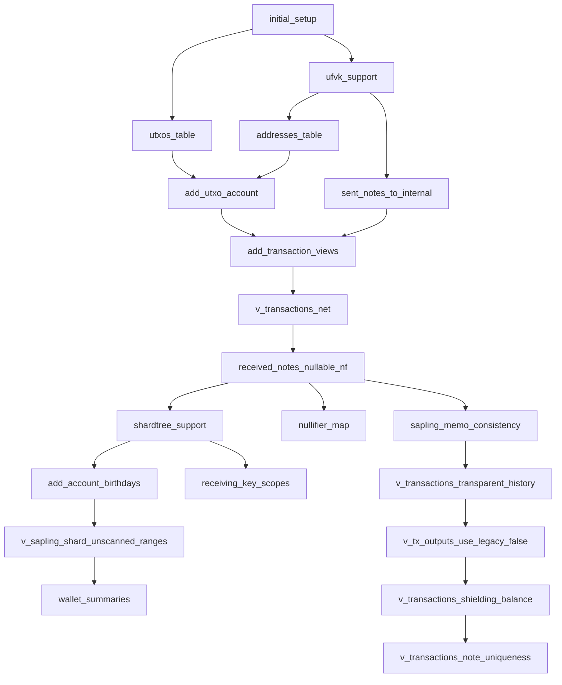

This graph can be rendered on github.com or with the `bierner.markdown-mermaid` extension in VS Code.

```mermaid
graph TD;
    initial_setup-->utxos_table;

    initial_setup-->ufvk_support;

    ufvk_support-->addresses_table;

    ufvk_support-->sent_notes_to_internal;

    utxos_table-->add_utxo_account;
    addresses_table-->add_utxo_account;

    sent_notes_to_internal-->add_transaction_views;
    add_utxo_account-->add_transaction_views;

    add_transaction_views-->v_transactions_net;

    v_transactions_net-->received_notes_nullable_nf;

    received_notes_nullable_nf-->shardtree_support;

    received_notes_nullable_nf-->nullifier_map;

    received_notes_nullable_nf-->sapling_memo_consistency;

    shardtree_support-->add_account_birthdays;

    shardtree_support-->receiving_key_scopes;

    sapling_memo_consistency-->v_transactions_transparent_history;

    add_account_birthdays-->v_sapling_shard_unscanned_ranges;

    v_transactions_transparent_history-->v_tx_outputs_use_legacy_false;

    v_tx_outputs_use_legacy_false-->v_transactions_shielding_balance;

    v_transactions_shielding_balance-->v_transactions_note_uniqueness;

    v_sapling_shard_unscanned_ranges-->wallet_summaries;
```